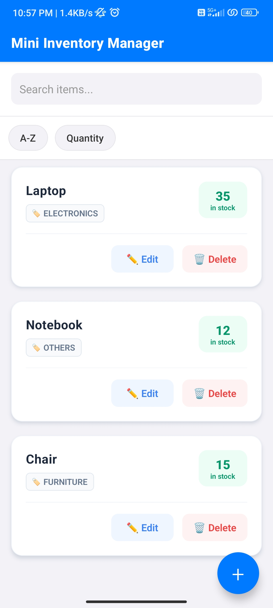
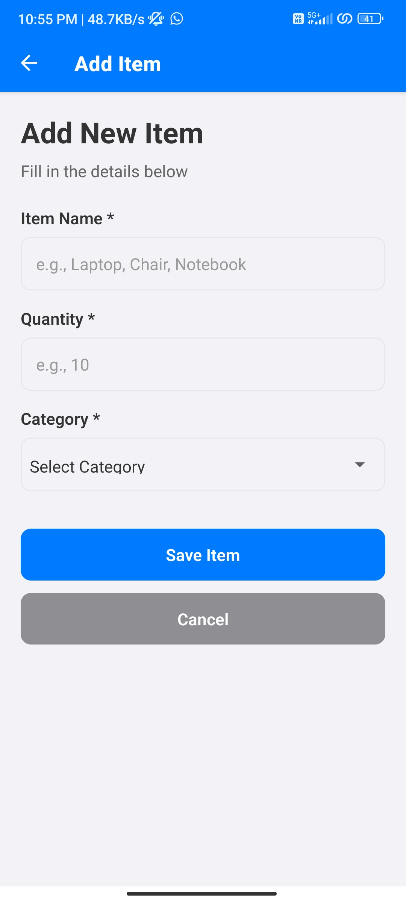
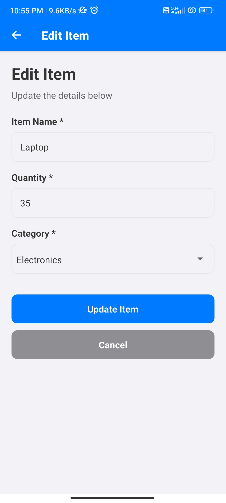
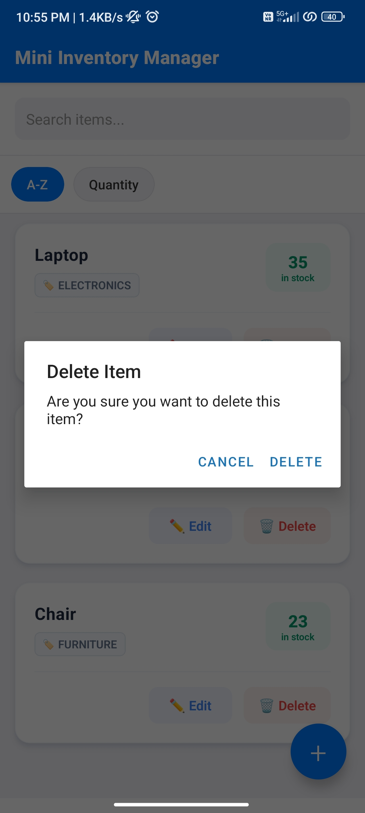
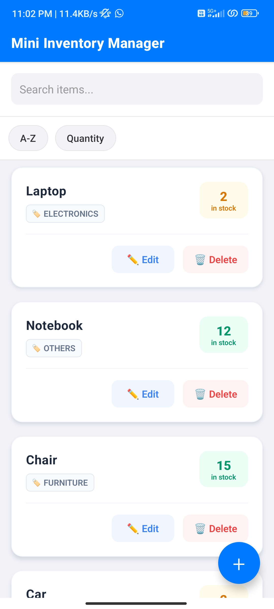
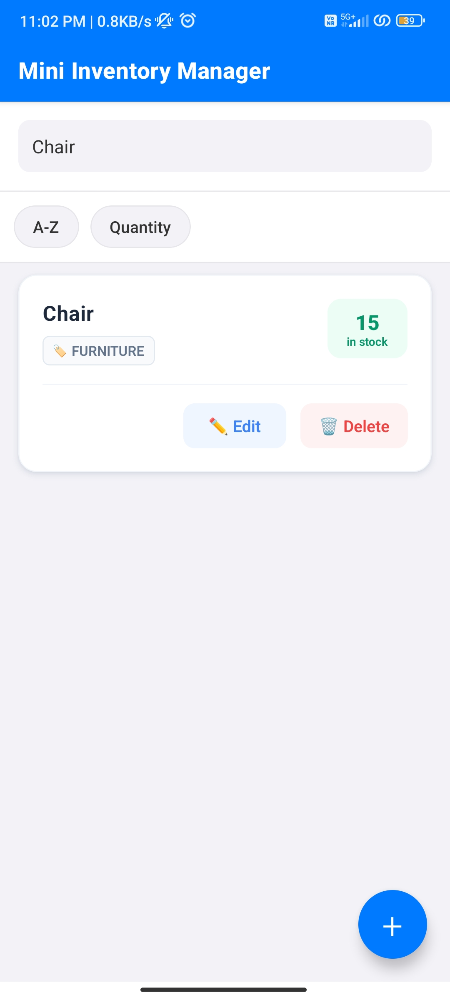
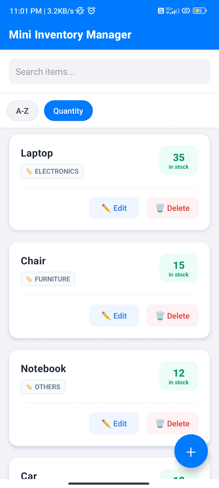
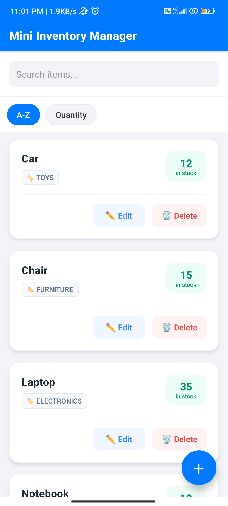

# 1. Mini Inventory Manager -- (App overview)

A simple, production-ready mobile application built with React Native and Expo for managing inventory items with local data persistence.

## 📱 Features

### Core Functionality
- ✅ **View Items**: Display inventory items in a clean, scrollable list with modern card design
- ✅ **Add Items**: Create new inventory items with name, quantity, and category dropdown
- ✅ **Edit Items**: Update existing items with pre-filled forms
- ✅ **Delete Items**: Remove items with confirmation dialog
- ✅ **Data Persistence**: All data stored locally using AsyncStorage

### Bonus Features
- 🔍 **Search**: Filter items by name in real-time
- 🔤 **Sorting**: Sort items alphabetically (A-Z) or by quantity
- ✔️ **Form Validation**: Comprehensive validation with error messages
- 🔄 **Pull to Refresh**: Refresh the item list by pulling down
- 📋 **Category Dropdown**: Predefined categories (Furniture, Electronics, Stationary, Grocery,     Pharmacy, Toys, Others)
- 🎨 **Modern UI**: Professional card design with stock status indicators and soft UI buttons

## 🛠️ Tech Stack

- **Framework**: React Native with Expo
- **Navigation**: React Navigation (Native Stack)
- **State Management**: React Hooks (useState, useEffect, useCallback)
- **Data Storage**: AsyncStorage
- **UI Components**: Custom reusable components

## 📁 Project Structure

```
mini-inventory-manager/
├── components/
│   ├── ItemCard.js          # Displays individual inventory item with modern UI
│   ├── CustomButton.js      # Reusable button component
│   ├── CustomInput.js       # Reusable input field component
│   └── CustomDropdown.js    # Category dropdown with predefined options
├── screens/
│   ├── HomeScreen.js        # Main screen with item list, search, and sort
│   ├── AddItemScreen.js     # Form to add new items
│   └── EditItemScreen.js    # Form to edit existing items
├── services/
│   └── storageService.js    # AsyncStorage CRUD operations
├── App.js                   # Main app with navigation setup
└── package.json             # Dependencies and scripts
```

# 2. 🚀 Installation & Setup

### Prerequisites
- Node.js (v14 or higher)
- npm or yarn
- Expo CLI (optional, will be installed automatically)

### Steps

1. **Clone the repository**
   ```bash
   git clone https://github.com/razi-dev/mini-inventory-manager.git
   cd mini-inventory-manager
   ```

2. **Navigate to the project folder**
   ```bash
   cd mini-inventory-manager
   ```

3. **Install dependencies**
   ```bash
   npm install
   ```

4. **Start the development server**
   ```bash
   npx expo start
   ```

5. **Run the app**
   - **Android**: Press `a` to open in Android emulator or scan QR code with Expo Go app

 # Screenshots 
   ## 📸 Screenshots

<div style="display: flex; gap: 10px;">

### Home Screen

*Modern card design with stock status indicators*

### Add Item Screen

*Category dropdown with predefined options*

### Edit Item Screen

*Pre-filled form for easy editing*

### Delete Confirm Screen

*Expo notification popup*

### Low Stock Screen

*Orange badge indicates low stock (< 10 units)*

### Search Screen

*Search bar at the top of the home screen*

### Sort Screen

*Sort options (Quantity)*

### Sort Screen

*Sort options (Character)*

</div>

## 📖 Usage Guide

### Adding an Item
1. Tap the **+** (floating action button) on the home screen
2. Fill in the item details:
   - Item Name (required)
   - Quantity (required, must be a positive number)
   - Category (required)
3. Tap **Save Item**

### Editing an Item
1. Tap the **Edit** button on any item card
2. Update the desired fields
3. Tap **Update Item**

### Deleting an Item
1. Tap the **Delete** button on any item card
2. Confirm deletion in the dialog

### Searching Items
- Use the search bar at the top of the home screen
- Type to filter items by name in real-time

### Sorting Items
- Tap **A-Z** to sort items alphabetically by name
- Tap **Quantity** to sort items by quantity (highest first)
- Tap again to remove sorting

# 🏗️ Architecture

### Component Architecture
- **Reusable Components**: All UI elements are modular and reusable
- **Separation of Concerns**: Business logic separated from UI components
- **Service Layer**: Data operations abstracted into service files

### State Management
- Uses React Hooks for local state management
- `useState` for component state
- `useEffect` for side effects
- `useCallback` for optimized callbacks
- `useFocusEffect` for screen focus handling

### Data Flow
1. User interacts with UI components
2. Components call service functions
3. Services interact with AsyncStorage
4. Data updates trigger UI re-renders

## 🎨 Design Principles

- **Clean UI**: Modern, user-friendly interface
- **Consistent Styling**: StyleSheet-based styling (no inline styles)
- **Responsive**: Works on various screen sizes
- **Accessible**: Clear labels and error messages
- **Performant**: FlatList for efficient list rendering

## 🧪 Testing

### Manual Testing Checklist
- [ ] Add multiple items with different data
- [ ] Edit existing items and verify changes persist
- [ ] Delete items and confirm removal
- [ ] Search for items by name
- [ ] Sort items by name and quantity
- [ ] Close and reopen app to verify data persistence
- [ ] Test form validation (empty fields, invalid quantity)
- [ ] Test on both Android and iOS (if possible)

## 📦 Building for Production

### Android APK
```bash
# Install EAS CLI
npm install -g eas-cli

# Configure EAS
eas build:configure

# Build APK
eas build -p android --profile preview
```

## 🔧 Dependencies

```json
{
  "@react-native-async-storage/async-storage": "^2.2.0",
  "@react-navigation/native": "^7.1.25",
  "@react-navigation/native-stack": "^7.8.6",
  "@react-native-picker/picker": "^2.11.1",
  "react-native-screens": "^4.16.0",
  "react-native-safe-area-context": "^5.6.0",
  "expo": "~54.0.29",
  "react": "19.1.0",
  "react-native": "0.81.5"
}
```

## 👨‍💻 Development Notes

### Code Quality
- All code is well-commented with JSDoc
- Consistent naming conventions
- Error handling in all async operations
- No hard-coded values

### Best Practices
- Modular component structure
- Reusable UI components
- Proper error handling
- Loading states for async operations
- Keyboard-aware forms

## 📝 Assignment Completion Status

### ✅ All Requirements Met

| Requirement | Status | Implementation |
|------------|--------|----------------|
| **React Native + Expo** | ✅ | Expo SDK 54 |
| **State Management** | ✅ | React Hooks (useState, useEffect, useCallback, useFocusEffect) |
| **AsyncStorage** | ✅ | Full CRUD implementation in `storageService.js` |
| **Reusable Components** | ✅ | ItemCard, CustomButton, CustomInput, CustomDropdown |
| **FlatList** | ✅ | Optimized list rendering in HomeScreen |
| **Clean Folder Structure** | ✅ | components/, screens/, services/ |
| **View Items** | ✅ | HomeScreen with modern card UI |
| **Add Items** | ✅ | AddItemScreen with category dropdown |
| **Edit Items** | ✅ | EditItemScreen with pre-filled form |
| **Delete Items** | ✅ | Delete with confirmation dialog |
| **Data Persistence** | ✅ | AsyncStorage - data survives app restart |
| **Form Validation** | ✅ | Comprehensive validation with error messages |
| **Search Bar** | ✅ | Real-time search by item name |
| **Sorting** | ✅ | A-Z and Quantity sorting |
| **README.md** | ✅ | Complete documentation |
| **GitHub Repository** | ✅ | https://github.com/razi-dev/mini-inventory-manager |

### 🎁 Bonus Features Implemented

- ✅ **Category Dropdown**: Predefined categories instead of free text
- ✅ **Pull to Refresh**: Refresh item list
- ✅ **Modern UI Design**: Professional card design with stock indicators
- ✅ **Stock Status**: Visual indicators for low stock items
- ✅ **Soft UI Buttons**: Modern button design with color coding
- ✅ **Empty State**: Helpful message when no items exist
- ✅ **useFocusEffect**: Proper screen lifecycle management

### 📊 Code Quality Highlights

- ✅ **Well-commented code** with JSDoc documentation
- ✅ **Consistent naming conventions** throughout
- ✅ **Error handling** in all async operations
- ✅ **No hard-coded values** - all styles in StyleSheet
- ✅ **Component reusability** - DRY principle followed
- ✅ **Separation of concerns** - business logic in services
- ✅ **Production-ready** code structure

## 📝 License

This project is open source and available for educational purposes.

## 🤝 Contributing

This is an assignment project, but suggestions and improvements are welcome!

---

**Built with ❤️ using React Native + Expo**
